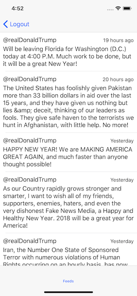

# IFTweetFeed
> An example on MVVM(protocol) for architecturing iOS projects

[![Swift Version][swift-image]][swift-url]
[![License][license-image]][license-url]
[](http://makeapullrequest.com)

Provide an example implementation of MVVM(protocol) for reference on how to architecture iOS projects



## Requirements

- iOS 11.0+
- Xcode 8

## Getting Started

### Obtain Application Key & Secret

Twitter requires that all API requests be authenticated with tokens that can be traced back to an individual Twitter App. If you already have keys for a Twitter app you can pass them directly to the `Twitter.sharedInstance().start()` method.

To create a new Twitter app or use existing Twitter app, visit [Twitter apps dashboard](https://apps.twitter.com/) and copy the keys from the “Keys and Access Tokens” tab of your app page.

To add call back URL:

1. In [Twitter apps dashboard](https://apps.twitter.com/), find your application and go to the permissions tab.
2. Select the appropriate permissions for your needs (e.g. “Read and write”)
3. If you are using login, add a placeholder URL in the Callback URL field (eg. “http://placeholder.com”).
4. Click update settings.

	Although the callback URL will not be requested by Twitter Kit in your app, it must be set to a valid URL for the app to work with the SDK.

### Initialize Twitter Kit

Inside your App Delegate, initialize Twitter Kit with your application key and secret (paste your own key and secret).

```swift
func application(_ application: UIApplication, didFinishLaunchingWithOptions launchOptions: [UIApplicationLaunchOptionsKey: Any]?) -> Bool {
    Twitter.sharedInstance().start(withConsumerKey:"hTpkPVU4pThkM0", consumerSecret:"ovEqziMzLpUOF163Qg2mj")

    return true
}
```

### Configure Info.Plist

Twitter Kit looks for a URL scheme in the format `twitterkit-<consumerKey>`, where `consumerKey` is your application’s Twitter API key, e.g. `twitterkit-dwLf79lNQfsJ`.

You can find your consumer key in the [Twitter app dashboard](https://apps.twitter.com/).

In your app’s `Info.plist`, add URL Schemes by adding code below after `<dict>`

```xml
<key>CFBundleURLTypes</key>
<array>
  <dict>
    <key>CFBundleURLSchemes</key>
    <array>
      <string>twitterkit-<consumerKey></string>
    </array>
  </dict>
</array>
<key>LSApplicationQueriesSchemes</key>
<array>
    <string>twitter</string>
    <string>twitterauth</string>
</array>
```

### Run It!

## Meta

Ivan Foong – [@vonze21](https://twitter.com/vonze21) – vonze21@gmail.com

Distributed under the MIT license. See ``LICENSE`` for more information.

<https://github.com/ivanfoong/>

[swift-image]:https://img.shields.io/badge/swift-4.0-orange.svg
[swift-url]: https://swift.org/
[license-image]: https://img.shields.io/badge/License-MIT-blue.svg
[license-url]: LICENSE
